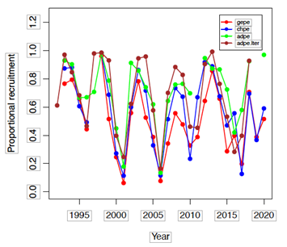

# First two weeks

This is the first entry into the weekly logbook I need to complete as part of this placement module. You might notice that the title says "First two weeks" - this is because I forgot I had to do this logbook weekly. But I've started now, and that's the important thing!

These first two weeks have been exciting, lonely, and exhausting. This internship is in Germany, in a small city called Bremerhaven. The biggest challenge so far has certainly been the culture shock. My coworkers speak excellent English, since I believe it's a requirement when working in science, but around the city it's much more rare. As such, I've found it hard to meet new people, and more often than not find myself alone, reflecting on the day with my own thoughts. In addition, my coworkers all live in Bremen, a much larger city nearby, and commute in, so it's very difficult to arrange any kind of social activities after work. Also, it rains rather a lot here.

Despite this veritable myriad of difficulties, I'm having a good time. Being in a brand new place is nerve wracking, but exciting, and I'm keeping busy with exercise, visiting new places, and, of course, my work. Speaking of...

## What have I done so far?

My position is as an intern in Prof. Dr. Bettina Meyer's working group, "Ecophysiology of Pelagic Key Species". Her primary interest is Antarctic krill, *Euphausia superba*, and their role in the ecosystem of the Southern Ocean. The project which I'm working on aims to gain a mechanistic understanding of Antarctic krill overwintering methods (how they survive being covered by sea ice), specifically looking at how lipid reserves affect this.

I've been working with a very large data set, which Bettina is excited about - apparently we've never had data at this resolution before! Here's a little taste:
<br>
```{r Krill data table,echo=FALSE}
source("prerequisites.R")
krill4disp = dplyr::filter(krill,Size>0)
krill4disp = subset(krill4disp,select=-c(RawKrill_Evaporation_Moisture_perc))
kable(head(krill4disp[1:8]),"simple")
```

Fun! This data is collected from fisheries, who harvest krill as a source of omega-3. In fact, that's what the "Lipids" column contains - the amount of omega-3 (in mg) from that krill catch. This is the column I've been focused on. As Bettina explained to me, before we start any real analysis, it's a good idea to understand what this data is showing us; which years have the most lipid content? Do we have data for each month? What's the proportion of lipid content between months?

To this end, my tasks for the past few weeks have been to visualise this data in an accessible and intuitive way. To start, Bettina suggested that I create pie charts for each year. Easy, right? Well, not exactly. Unfortunately, the graph package that I like, ggplot, does not have a function to make pie charts. To make one, you have to create a stacked bar chart, then change the coordinates to modify how the graph is plotted. As a result, doing anything to the final product (such as adding labels or reordering the slices) is way more complicated. Moreover, since I needed a pie chart for every year, this process had to be automated with a loop (lest I wanted to sit in this office typing the same code 10 times). Fortunately, I really enjoy this kind of stuff! Here's the whistle-stop tour of my process.

### Krill lipid pie charts

To start, I tested making a pie chart with just one year, before throwing my code into a big slow loop. After a day of trial and error (the most difficult part, incredibly, being changing the order of the slices), I had a successful pie chart.
<br>
```{r Pie chart with one year, echo=FALSE, fig.align='center'}
krill2013 = dplyr::filter(krill,grepl(2013,date.YMD)) #Filters the whole data set to only use one year; this one is 2013
for (j in krill2013$date.YMD){ #Extracts the month from each date, so we can easily differentiate by month
  krill2013$specMonth=(stri_sub(krill2013$date.YMD,6,7))
}
monthlyLipids = data.frame() #New data frame to put the monthly lipid data into

#This section sums up each month's total lipids and puts them into a separate data frame
#This means that we can more clearly visualise the separation between months
krill_pal = hue_pal()(12) # Sets the colour palette
for (u in monthNums){
  tempMonth = dplyr::filter(krill2013,grepl(u,specMonth))
  monthSum = sum(tempMonth$Lipids,na.rm=TRUE)
  monthMean = monthSum/length(tempMonth$specMonth)
  if (((is.nan(monthMean)==TRUE|(monthMean==0)==TRUE))==TRUE){
    monthlyLipids = rbind(monthlyLipids,c(0,u,2013))
    krill_pal[as.numeric(u)] = "#454545"
  } else {
    monthlyLipids = rbind(monthlyLipids,c(monthMean,u,2013))}
}

# Housekeeping; we like tidy tables!
colnames(monthlyLipids) = c("lipidMean","Month","Year")
monthlyLipids$lipidMean = as.numeric(monthlyLipids$lipidMean)
monthlyLipids$Month = as.factor(monthlyLipids$Month)
monthlyLipids$Year = as.character(monthlyLipids$Year)

# Create the plot
pieTitle = expression(paste("Mean Monthly Lipid Content of ", italic("Euphausia superba"), ", 2013"))
krillPie = ggplot(monthlyLipids,aes(x=Year,y=lipidMean,fill=Month)) +
  geom_bar(stat="identity",width=1,color="white") +
  coord_polar("y",start=0,direction=-1,clip="off") +
  theme_void() +
  scale_fill_manual(labels=c(allMonths),values=krill_pal) +
  ggtitle(pieTitle)
krillPie
```
<br>
Ideal! Next came making the loop and adding labels, which took way less time.
<br>
```{r The loop!, eval=FALSE}
for (i in years){
  krill_pal = hue_pal()(12)
  remove(krillYEAR,krillPie,tempMonth,labelPos)
  krillYEAR = dplyr::filter(krill,grepl(as.character(i),date.YMD)) # Filters the whole data set to just use one year at a time
  for (j in krillYEAR$date.YMD){ # Extacts the month from each date, so we can more easily differentiate between them
    krillYEAR$specMonth=(stri_sub(krillYEAR$date.YMD,6,7))
    monthlyLipids = data.frame()
    badMonth = c()
    n=1
    
    #This section sums up each month's total lipids and puts them into a separate data frame
    #This means that we can more clearly visualise the separation between months
    for (u in monthNums){
      tempMonth = dplyr::filter(krillYEAR,grepl(u,specMonth))
      monthSum = sum(tempMonth$Lipids,na.rm=TRUE)
      monthMean = monthSum/length(tempMonth$specMonth)
      if (((is.nan(monthMean)==TRUE|(monthMean==0)==TRUE))==TRUE){ # Surely there's an easier way to do this? Oh well...
        monthlyLipids = rbind(monthlyLipids,c(0,u,i))
        krill_pal[as.numeric(u)] = "#454545"
        badMonth[n] = as.numeric(u)
        n=n+1
      } else {
        monthlyLipids = rbind(monthlyLipids,c(monthMean,u,i))}
    }
    
    # Housekeeping; We like tidy tables!
    colnames(monthlyLipids) = c("lipidMean","Month","Year")
    monthlyLipids$lipidMean = as.numeric(monthlyLipids$lipidMean)
    monthlyLipids$Month = as.factor(monthlyLipids$Month)
    monthlyLipids$Year = as.character(monthlyLipids$Year)
    
    # Calculate the position of the labels
    labelPos = monthlyLipids %>%
      mutate(csum = rev(cumsum(rev(lipidMean))),
             pos = lipidMean/2 + lead(csum, 1),
             pos = if_else(is.na(pos), lipidMean/2, pos,))
    labelPos$pos[badMonth] = NA
    
    # Make the plot
    krillPie = ggplot(monthlyLipids,aes(x=Year,y=lipidMean,fill=Month)) +
      geom_bar(stat="identity",
               width=1,
               color="white") +
      coord_polar("y",start=0,direction=-1,clip="off") +
      theme_void() +
      scale_fill_manual(labels=c(allMonths),values=krill_pal) +
      geom_label_repel(labelPos, mapping=aes(y=pos, label=paste0(round(lipidMean,digits=2),"mg")),
                       size = 6.5, nudge_x = 0.7, show.legend = FALSE, na.rm = TRUE) +
      ggtitle(i,subtitle=paste(as.character(round((sum(krillYEAR$Lipids,na.rm=TRUE)/1000),digits=2)), "g total")) + theme(plot.title = element_text(size = 22, face = "bold"), plot.subtitle = element_text(size = 19.5), legend.key.height=unit(0.5,"cm"),legend.title=element_text(size=18,face="bold"),legend.text=element_text(size=17))
    assign(paste0("krill",i),krillPie)
  }
}
```
```{r Load the actual year objects, echo = FALSE}
load("krillOBJECTS.RData")
```
<br>
With each pie chart neatly stored into its own variable, they can be plotted all together as a lovely big graph.
<br>
```{r Krill pie, layout="1-page", fig.height = 12, fig.width = 20, echo=FALSE}
pieFestival = plot_grid(krill2011,krill2012,krill2013,krill2014,krill2015,krill2016,krill2017,krill2018,krill2019,krill2020,krill2021)
title = ggdraw() +
  draw_label("Monthly Mean Omega-3 Content of Krill Stomachs (2011-2022)",
    fontface = "bold",
    size = 30,
    x = 0,
    hjust = 0) +
  theme(plot.margin = margin(0,0,0,7))

plot_grid(
  title,pieFestival,
  ncol = 1,
  rel_heights = c(0.1,1))
```
<br>
And that concluded my first week! I'm incredibly happy that I was able to work out how to create this graph, since I was a bit rusty with my R. I think the last time I really sunk my teeth into this kind of project was in my MBIO227 coursework, with the data we collected in Sweden. The biggest challenge was understanding how R handles data frames - it tends to do so in the most backwards and un-intuitive way possible, so reigning it in and making it do what I actually wanted was frustrating. However, as always, this was a rewarding process; I finished my first week understanding a lot more about data handling packages, base R, and, of course, Antarctic krill.

::: floatting
### Comparing specific months
```{r Tiny krill recruitment graph, out.width="30%",out.extra='style="float:right; padding:8px"',echo = FALSE}

```
Now that we had an idea of how the lipid levels vary year-by-year, the natural next step was to investigate in more detail. Krill spawn in Austral spring (August/September-ish), and their success depends on their lipid stores, which they use as a source of energy.

Bettina was interested in discovering whether or not the changes in lipid levels between the Austral spring of each year had any correlation with years of high and low krill biomass. I don't yet have access to the yearly krill recruitment data (although I was provided with this tiny graph (right)). In the meantime, I plotted a bar graph to visualise how the mean lipid content of June-September changes with each year. What I expected to see was the bar heights roughly matching the pattern in the krill recruitment graph...
:::
<br>
```{r Mean lipids over time, warning = FALSE, fig.align='center'}
inspectaMonth = "06 07 08 09" %>%
  strsplit("[[:space:]]") %>%
  unlist()
seasonalLipids = data.frame()
for (i in years){
  krillYEAR = dplyr::filter(krill,grepl(as.character(i),date.YMD))
  for (j in inspectaMonth){
    MONTHkrill = dplyr::filter(krillYEAR,grepl(paste0("-",j,"-"),date.YMD))
    MONTHsum = sum(MONTHkrill$Lipids,na.rm=TRUE)
    MONTHmean = MONTHsum/length(MONTHkrill$date.YMD)
    MONTHsd = sd(MONTHkrill$Lipids,na.rm=TRUE)
    seasonalLipids = rbind(seasonalLipids,c(i,MONTHmean,j,MONTHsd))
  }
}

colnames(seasonalLipids) = c("Year","Lipids","Month","SD")
seasonalLipids$Lipids = as.numeric(seasonalLipids$Lipids)
seasonalLipids$Month = as.factor(seasonalLipids$Month)
seasonalLipids$SD = as.numeric(seasonalLipids$SD)
seasonalLipids[seasonalLipids==0] = NA

krillCocktail = ggplot(seasonalLipids,aes(x=Year,y=Lipids,fill=Month)) +
  geom_bar(stat="identity",position=position_dodge(0.9)) +
  scale_fill_discrete(labels=allMonthsLong[as.numeric(inspectaMonth)]) +
  geom_errorbar(aes(ymin=Lipids,ymax=Lipids+SD),position=position_dodge(0.9),width=0.2) +
  ggtitle("Mean omega-3 Content of Krill Stomachs") +
  labs(y="Mean Omega-3 Content (mg)")
krillCocktail
```
<br>
Yeah, kind of! There looks like a rough up-down wave in that graph. I showed this to Bettina, and she seemed concerned about the standard deviation on some of those years as well as the sharp increase in lipid measurements from 2019 onwards. She suggested this may be something to do with the fisheries changing their sampling and measurement methods, but she's going to double check that. In addition, she suggested that I inspect just August, as this is the month when we would expect the most lipids to be present (because they're about to spawn, so they need lipids for a whole bunch of internal processes). Here's that graph:
<br>
```{r Mean lipid content each August, echo = FALSE, fig.align = 'center'}
seasonalLipids = data.frame()
for (i in years){
  krillYEAR = dplyr::filter(krill,grepl(as.character(i),date.YMD))
  MONTHkrill = dplyr::filter(krillYEAR,grepl("-08-",date.YMD))
  MONTHsum = sum(MONTHkrill$Lipids,na.rm=TRUE)
  MONTHmean = MONTHsum/length(MONTHkrill$date.YMD)
  MONTHsd = sd(MONTHkrill$Lipids,na.rm=TRUE)
  seasonalLipids = rbind(seasonalLipids,c(i,MONTHmean,"08",MONTHsd))
}

colnames(seasonalLipids) = c("Year","Lipids","Month","SD")
seasonalLipids$Lipids = as.numeric(seasonalLipids$Lipids)
seasonalLipids$Month = as.factor(seasonalLipids$Month)
seasonalLipids$SD = as.numeric(seasonalLipids$SD)
seasonalLipids[seasonalLipids==0] = NA

krillCocktail = ggplot(seasonalLipids,aes(x=Year,y=Lipids,fill=Month)) +
  geom_bar(stat="identity",position=position_dodge(0.9)) +
  scale_fill_discrete(labels=allMonthsLong[8]) +
  geom_errorbar(aes(ymin=Lipids,ymax=Lipids+SD),position=position_dodge(0.9),width=0.2) +
  ggtitle("Mean omega-3 Content of Krill Stomachs each August") +
  labs(y="Mean Omega-3 Content (mg)")
krillCocktail
```
<br>
Yeah, there looks like a much more clear relationship between high lipid years and high krill biomass. Hopefully when we receive the krill biomass/recruitment data, that hypothesis can actually be tested statistically!